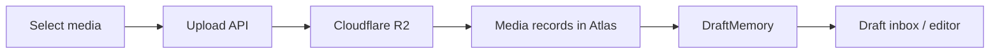

# Kickstart app models

> https://chatgpt.com/share/6a64e15a-ce88-83e8-8472-6f36823b4c1d
> Can you read this chat? As per the last message I want my application to behave exactly like this. Let's start with the models and kickstarting the project. The backend and frontend scaffolding is already in the project structure. In case its not visible in the chat, for frontend its angular, for backend its express, for images storage its R2 storage in cloudflare, for frontend deployment its cloudflare pages, and for backend deployment ill be using render, and mongodb atlas for db

<details><summary>17 previous messages</summary>

> I’ll first read the shared conversation and inspect the existing project scaffolding, then I’ll shape the initial backend models around the agreed behavior.
>
> <details><summary>Searched the web</summary>
>
> Searched the web for `https://chatgpt.com/share/6a64e15a-ce88-83e8-8472-6f36823b4c1d`
>
> Searched the web for `https://chatgpt.com/share/6a64e15a-ce88-83e8-8472-6f36823b4c1d`
>
> </details>
>
> The shared page isn’t available through the standard reader, so I’m using the in-app browser to retrieve the conversation contents directly.
>
> <details><summary>Ran a command, called a tool</summary>
>
> - Ran `Get-Content -Raw 'C:\Users\Admin\.codex\plugins\cache\openai-bundled\browser\26.721.41059\skills\control-in-app-browser\SKILL.md'`
>
> MCP tool call
>
> node_repl.js
>
> ```json
> {
>   "title": "Open shared conversation",
>   "code": "if (globalThis.agent?.browsers == null) {\n  const { setupBrowserRuntime } = await import(\"C:/Users/Admin/.codex/plugins/cache/openai-bundled/browser/26.721.41059/scripts/browser-client.mjs\");\n  await setupBrowserRuntime({ globals: globalThis });\n}\nif (globalThis.browser == null) {\n  globalThis.browser = await agent.browsers.getForUrl(\"https://chatgpt.com/share/6a64e15a-ce88-83e8-8472-6f36823b4c1d\");\n  nodeRepl.write(await browser.documentation());\n}"
> }
> ```
>
> ```text
> node_repl kernel exited unexpectedly
>
> node_repl diagnostics: {"kernel_pid":9748,"kernel_status":"exited(code=1)","kernel_stderr_tail":"node:fs:2775 |       const stats = binding.lstat(base, true, undefined, true /* throwIfNoEntry */); |                             ^ | Error: EPERM: operation not permitted, lstat 'C:\\Users\\Admin\\AppData' |     at Object.realpathSync (node:fs:2775:29) |     at toRealPath (node:internal/modules/helpers:62:13) |     at Module._findPath (node:internal/modules/cjs/loader:781:22) |     at resolveMainPath (node:internal/modules/run_main:35:21) |     at Module.executeUserEntryPoint [as runMain] (node:internal/modules/run_main:146:20) |     at node:internal/main/run_main_module:33:47 { |   errno: -4048, |   code: 'EPERM', |   syscall: 'lstat', |   path: 'C:\\\\Users\\\\Admin\\\\AppData' | } | Node.js v24.14.0","reason":"stdout_eof","stream_error":null}
> ```
>
> </details>
>
> I couldn’t establish a browser session to the shared page in this workspace. I’ll inspect the project now; if the conversation details aren’t present there, I’ll need you to paste its final message so I can match the behavior precisely.
>
> <details><summary>Ran 13 commands</summary>
>
> - Ran `Get-ChildItem -Force; rg --files -g "!node_modules" -g "!dist" -g "!coverage" | Select-Object -First 400`
> - Ran `Get-Content -Raw memories-backend\package.json; Get-Content -Raw memories-backend\app.ts; Get-Content -Raw memories-backend\env.ts; Get-Content -Raw memories-backend\tsconfig.json; Get-Content -Raw memories-frontend\package.json; Get-Content -Raw memories-frontend\src\app\app.routes.ts; Get-Content -Raw memories-frontend\src\app\app.ts`
> - Ran `Invoke-WebRequest -Uri 'https://chatgpt.com/share/6a64e15a-ce88-83e8-8472-6f36823b4c1d' -UseBasicParsing | Select-Object -ExpandProperty Content`
> - Ran `Invoke-WebRequest -Uri 'https://chatgpt.com/share/6a64e15a-ce88-83e8-8472-6f36823b4c1d' -UseBasicParsing | Select-Object -ExpandProperty Content`
> - Ran `$response = Invoke-WebRequest -Uri 'https://chatgpt.com/share/6a64e15a-ce88-83e8-8472-6f36823b4c1d' -UseBasicParsing; $clean = $response.Content -replace '(?is)<script.*?</script>', ' ' -replace '(?is)<style.*?</style>', ' ' -replace '(?is)<[^>]+>', ' '; [System.Net.WebUtility]::HtmlDecode($clean) -replace '\s+', ' '`
> - Ran `$html = (Invoke-WebRequest -Uri 'https://chatgpt.com/share/6a64e15a-ce88-83e8-8472-6f36823b4c1d' -UseBasicParsing).Content; [regex]::Matches($html, '"(?:[^"\\]|\\.)*"') | ForEach-Object { try { $value = $_.Value | ConvertFrom-Json; if ($value -match '(?i)anniversary|website|memory|memories|romantic|couple') { $value } } catch {} } | Select-Object -Unique`
> - Ran `$html = (Invoke-WebRequest -Uri 'https://chatgpt.com/share/6a64e15a-ce88-83e8-8472-6f36823b4c1d' -UseBasicParsing).Content; [regex]::Matches($html, '"(?:[^"\\]|\\.)*"') | ForEach-Object { try { $value = $_.Value | ConvertFrom-Json; if ($value.Length -lt 5000 -and $value -match '(?i)anniversary|website|memory|memories|romantic|couple|photo|story') { $value } } catch {} } | Select-Object -Unique`
> - Ran `$html = (Invoke-WebRequest -Uri 'https://chatgpt.com/share/6a64e15a-ce88-83e8-8472-6f36823b4c1d' -UseBasicParsing).Content; $needle = 'upload-photos'; $index = $html.IndexOf($needle); "Index: $index"; if ($index -ge 0) { $start = [Math]::Max(0, $index - 4000); $length = [Math]::Min(12000, $html.Length - $start); $html.Substring($start, $length) }`
> - Ran `$response = Invoke-WebRequest -Uri 'https://chatgpt.com/backend-api/share/6a64e15a-ce88-83e8-8472-6f36823b4c1d' -UseBasicParsing; $response.StatusCode; $response.Content`
> - Ran `$html = (Invoke-WebRequest -Uri 'https://chatgpt.com/share/6a64e15a-ce88-83e8-8472-6f36823b4c1d' -UseBasicParsing).Content; [regex]::Matches($html, '"(?:[^"\\]|\\.)*"') | ForEach-Object { try { $value = $_.Value | ConvertFrom-Json; if ($value -is [string] -and $value.Length -lt 5000 -and $value -match '(?i)anniversary|website|memory|memories|romantic|couple|photo|story') { $value } } catch {} } | Select-Object -Unique`
> - Ran `$html = (Invoke-WebRequest -Uri 'https://chatgpt.com/share/6a64e15a-ce88-83e8-8472-6f36823b4c1d' -UseBasicParsing).Content; $chunks = [regex]::Matches($html, 'streamController\.enqueue\((?<payload>"(?:[^"\\]|\\.)*")\)') | ForEach-Object { $_.Groups['payload'].Value | ConvertFrom-Json }; "Chunks: $($chunks.Count)"; $chunks | ForEach-Object { "Length: $($_.Length) | Start: $($_.Substring(0, [Math]::Min(180, $_.Length)))" }`
> - Ran `$html = (Invoke-WebRequest -Uri 'https://chatgpt.com/share/6a64e15a-ce88-83e8-8472-6f36823b4c1d' -UseBasicParsing).Content; $payload = ([regex]::Matches($html, 'streamController\.enqueue\((?<payload>"(?:[^"\\]|\\.)*")\)')[0].Groups['payload'].Value | ConvertFrom-Json); $data = $payload | ConvertFrom-Json -AsHashtable; function Get-LeafStrings($node) { if ($node -is [string]) { $node; return }; if ($node -is [System.Collections.IDictionary]) { foreach ($value in $node.Values) { Get-LeafStrings $value }; return }; if ($node -is [System.Collections.IEnumerable]) { foreach ($value in $node) { Get-LeafStrings $value } } }; Get-LeafStrings $data | Where-Object { $_.Length -ge 50 -and $_.Length -le 10000 -and $_ -match '\s' -and $_ -match '[A-Za-z]{4}' } | Select-Object -Unique`
> - Ran `$html = (Invoke-WebRequest -Uri 'https://chatgpt.com/share/6a64e15a-ce88-83e8-8472-6f36823b4c1d' -UseBasicParsing).Content; $payload = ([regex]::Matches($html, 'streamController\.enqueue\((?<payload>"(?:[^"\\]|\\.)*")\)')[0].Groups['payload'].Value | ConvertFrom-Json); $data = $payload | ConvertFrom-Json; function Get-LeafStrings($node) { if ($node -is [string]) { $node; return }; if ($node -is [System.Collections.IEnumerable]) { foreach ($value in $node) { Get-LeafStrings $value }; return }; if ($null -ne $node) { foreach ($property in $node.PSObject.Properties) { Get-LeafStrings $property.Value } } }; Get-LeafStrings $data | Where-Object { $_.Length -ge 50 -and $_.Length -le 10000 -and $_ -match '\s' -and $_ -match '[A-Za-z]{4}' } | Select-Object -Unique`
>
> </details>
>
> I’ve read the shared chat. The core I’m carrying forward is a memory-first relationship scrapbook: independent media, ordered story blocks (text, photos, galleries, videos, maps, quotes, headings, dividers), and drafts for both incomplete manual work and uploaded-media suggestions. I’ll scaffold that now without introducing authentication or deployment wiring prematurely.
>
> <details><summary>Created 18 files, edited 3 files, ran 4 commands</summary>
>
> - Ran `git status --short; Get-ChildItem -Recurse -File -Filter AGENTS.md | Select-Object -ExpandProperty FullName; Get-ChildItem -Force memories-backend; Get-ChildItem -Force memories-frontend\src\app`
> - Ran `Get-Content -Raw memories-backend\.gitignore; Get-Content -Raw memories-frontend\tsconfig.app.json; Get-Content -Raw memories-frontend\src\app\app.config.ts; Get-Content -Raw memories-frontend\src\main.ts`
> - Ran `Get-Content -Raw memories-frontend\tsconfig.json; Get-Content -Raw memories-frontend\angular.json`
> - Ran `Get-Content -Raw proxy.conf.json; Get-Content -Raw memories-frontend\README.md; Get-Content -Raw README.md`
> - Wrote `./memories-backend/.env.example` (+16 -0)
> - Wrote `./memories-backend/package.json` (+5 -4)
> - Wrote `./memories-backend/src/app.ts` (+40 -0)
> - Wrote `./memories-backend/src/config/database.ts` (+13 -0)
> - Wrote `./memories-backend/src/config/env.ts` (+47 -0)
> - Wrote `./memories-backend/src/config/r2.ts` (+21 -0)
> - Wrote `./memories-backend/src/modules/media/media.model.ts` (+38 -0)
> - Wrote `./memories-backend/src/modules/media/media.types.ts` (+35 -0)
> - Wrote `./memories-backend/src/modules/memory/draft-memory.model.ts` (+47 -0)
> - Wrote `./memories-backend/src/modules/memory/memory-block.schema.ts` (+18 -0)
> - Wrote `./memories-backend/src/modules/memory/memory.model.ts` (+34 -0)
> - Wrote `./memories-backend/src/modules/memory/memory.types.ts` (+74 -0)
> - Wrote `./memories-backend/src/modules/tag/tag.model.ts` (+27 -0)
> - Wrote `./memories-backend/src/modules/tag/tag.types.ts` (+5 -0)
> - Wrote `./memories-backend/src/server.ts` (+27 -0)
> - Wrote `./memories-backend/tsconfig.json` (+1 -1)
> - Wrote `./memories-frontend/package.json` (+1 -1)
> - Wrote `./memories-frontend/public/_redirects` (+1 -0)
> - Wrote `./memories-frontend/src/app/core/api/api-base-url.token.ts` (+9 -0)
> - Wrote `./memories-frontend/src/app/models/memory.ts` (+31 -0)
> - Wrote `./shared/contracts/memory.ts` (+36 -0)
>
> </details>
>
> The data model is now being split into feature modules. Media holds R2 object keys and extracted metadata; memories and drafts reference media and arrange it into editable blocks, which keeps the upload-to-draft-to-memory flow intact.
>
> <details><summary>Ran 3 commands</summary>
>
> - Ran `git status --short; rg --files memories-backend\src shared memories-frontend\src\app\core memories-frontend\src\app\models; Get-Content -Raw memories-backend\package.json; Get-Content -Raw memories-backend\tsconfig.json`
> - Ran `npm run build`
> - Ran `npm run build`
>
> </details>
>
> The project structure is in place. The first verification hit the local PowerShell execution policy rather than a code failure, so I’m rerunning both builds through the Windows command shim.
>
> <details><summary>Edited a file, ran 4 commands</summary>
>
> - Ran `npm.cmd run build`
> - Ran `npm.cmd run build`
> - Wrote `./memories-backend/src/modules/tag/tag.model.ts` (+1 -2)
> - Ran `npm.cmd run build`
> - Ran `npm.cmd run build`
>
> </details>
>
> The backend now compiles. The Angular build exposed one existing scaffold issue—its route array was imported but not exported—so I’m fixing that small wiring problem before the final verification.
>
> <details><summary>Edited a file, ran a command</summary>
>
> - Wrote `./memories-frontend/src/app/app.routes.ts` (+1 -1)
> - Ran `npm.cmd run build`
>
> </details>
>
> The frontend is rebuilding after the route fix. I’ve also added Cloudflare Pages’ SPA redirect rule and kept the local `/api` proxy in the frontend start command, so routing will behave correctly in both environments.
>
> <details><summary>Edited a file, ran 5 commands</summary>
>
> - Ran `npm.cmd run build`
> - Ran `node.exe --input-type=module --eval "import { Memory } from './dist/src/modules/memory/memory.model.js'; import { DraftMemory } from './dist/src/modules/memory/draft-memory.model.js'; import { Tag } from './dist/src/modules/tag/tag.model.js'; const memory = new Memory({ title: 'First Rainy Date', blocks: [{ type: 'text', position: 0, content: { text: 'We found a tiny cafe.' } }] }); const draft = new DraftMemory({ source: 'upload', status: 'pending_review', candidateMedia: [] }); const tag = new Tag({ name: ' Rainy Day ' }); await Promise.all([memory.validate(), draft.validate(), tag.validate()]); console.log(JSON.stringify({ memoryBlocks: memory.blocks.length, draftStatus: draft.status, tagSlug: tag.slug }));"`
> - Ran `git status --short; git diff -- memories-backend/package.json memories-frontend/package.json memories-frontend/src/app/app.routes.ts; Get-Content -Raw memories-frontend\.gitignore 2>$null; Get-Content -Raw memories-backend\.gitignore`
> - Wrote `./memories-backend/.gitignore` (+2 -1)
> - Ran `git diff --check`
> - Ran `git status --short`
>
> </details>
>
> <details><summary>Plan</summary>
>
> The feature-first scaffold, data models, shared contracts, and deployment-ready frontend routing are in place and verified.
>
> - [x] Inspect the current scaffold and preserve existing work
> - [x] Create feature-first backend configuration and domain models
> - [x] Add shared/frontend domain contract scaffolding
> - [x] Build and verify the backend
>
> </details>
</details>

Implemented the memory-first foundation.

- Mongoose models for independent [Media](./memories-backend/src/modules/media/media.model.ts), block-based [Memory](./memories-backend/src/modules/memory/memory.model.ts), [DraftMemory](./memories-backend/src/modules/memory/draft-memory.model.ts), and [Tag](./memories-backend/src/modules/tag/tag.model.ts).
- Blocks support text, headings, images, galleries, video, maps, quotes, and dividers—with caption and extensible content.
- Added MongoDB/R2 configuration, example environment variables, safe CORS, graceful startup, and `/api/health`.
- R2 stores object keys rather than URLs, so CDN/domain changes won’t require data migration.
- Added shared/frontend domain contracts, local API proxy support, and Cloudflare Pages SPA redirects.
- Fixed the existing Angular route export issue.

Verified:

- Backend TypeScript build passes.
- Frontend production build passes.
- Model validation smoke test passes.

Set your Atlas and R2 values from [`.env.example`](./memories-backend/.env.example), then the next vertical slice should be media upload → DraftMemory creation → draft curation.

> can you just explain me the changes done and at what level is my project right now?

Your project is now at the “foundation complete, features not yet connected” stage.

What changed:

- Backend is reorganized into feature modules:
  - `media` for uploaded photos/videos
  - `memory` for published relationship stories
  - `tag` for moods/categories such as `rainy-day` or `travel`
  - `config` for MongoDB, Cloudflare R2, CORS, and environment values

- You now have the core database models:
  - **Media**: one uploaded photo/video/audio item. The actual file lives in Cloudflare R2; MongoDB stores its R2 key, metadata, date, location, thumbnail/preview keys, and processing status.
  - **Memory**: a finished story such as “First Rainy Date.” It contains ordered blocks—text, image, gallery, video, map, quote, heading, divider—rather than a fixed description plus photos.
  - **DraftMemory**: an unfinished manual memory or an automatically grouped upload. This is what enables upload → review/edit → approve → publish as a Memory.
  - **Tag**: reusable labels for filtering, moods, gallery, timeline, and random-memory experiences.

- Added deployment-friendly basics:
  - `.env.example` shows every value needed for Atlas and R2.
  - R2 setup is isolated, ready for upload code.
  - `/api/health` confirms the API is running.
  - Angular’s local `/api` proxy is wired.
  - Cloudflare Pages SPA redirects are added.
  - Both backend and frontend production builds succeed.

Where you are today:

```text
Database design       ✅ Ready
Backend structure     ✅ Ready
Angular scaffold      ✅ Ready
Atlas / R2 connection 🟨 Needs your real environment values
API endpoints         ⏳ Not built
Upload to R2          ⏳ Not built
Draft creation        ⏳ Not built
Memory editor UI      ⏳ Not built
Timeline/gallery/home ⏳ Not connected
Deployment            ⏳ Not configured
```

The next meaningful step is the first complete flow: upload media to R2 → save Media records → create a DraftMemory → display it for approval.

> I have added atlas/r2 connection values, now what do we do next

<details><summary>6 previous messages</summary>

> Great—next we should verify both connections without exposing any secrets, then build the first real vertical slice: media upload to R2 → `Media` record → draft creation.
>
> <details><summary>Ran a command</summary>
>
> - Ran `node.exe --input-type=module --eval "import { HeadBucketCommand } from '@aws-sdk/client-s3'; import { connectDatabase, disconnectDatabase } from './dist/src/config/database.js'; import { createR2Client, getR2BucketName } from './dist/src/config/r2.js'; try { await connectDatabase(); await createR2Client().send(new HeadBucketCommand({ Bucket: getR2BucketName() })); console.log('MongoDB Atlas and Cloudflare R2 connections verified.'); } finally { await disconnectDatabase(); }"`
>
> </details>
>
> The check reached your environment file but timed out while making the external Atlas/R2 calls, which is consistent with the workspace network restriction. I’m retrying the same read-only connectivity test with network access.
>
> <details><summary>Ran a command</summary>
>
> - Ran `node.exe --input-type=module --eval "import { HeadBucketCommand } from '@aws-sdk/client-s3'; import { connectDatabase, disconnectDatabase } from './dist/src/config/database.js'; import { createR2Client, getR2BucketName } from './dist/src/config/r2.js'; try { await connectDatabase(); await createR2Client().send(new HeadBucketCommand({ Bucket: getR2BucketName() })); console.log('MongoDB Atlas and Cloudflare R2 connections verified.'); } finally { await disconnectDatabase(); }"`
>
> </details>
>
> Atlas could not resolve its SRV DNS record from this environment (`ECONNREFUSED`), so MongoDB was never reached. I’ll test R2 separately; for Atlas, the next check is the Atlas Network Access/IP allow-list and the exact connection string.
>
> <details><summary>Ran a command</summary>
>
> - Ran `node.exe --input-type=module --eval "import { HeadBucketCommand } from '@aws-sdk/client-s3'; import { createR2Client, getR2BucketName } from './dist/src/config/r2.js'; await createR2Client().send(new HeadBucketCommand({ Bucket: getR2BucketName() })); console.log('Cloudflare R2 connection verified.');"`
>
> </details>
</details>

R2 is connected successfully. ✅

Atlas is not reachable from this workspace yet because its DNS SRV lookup was refused—not because of the database credentials themselves.

Before we build the upload flow, please check Atlas:

1. Atlas → **Network Access** → allow your current IP for development.
2. Confirm the cluster is active.
3. Recopy the connection string into `MONGODB_URI`.
4. If SRV continues failing, use Atlas’s standard `mongodb://...` connection string instead of `mongodb+srv://...`.

Once Atlas connects, we build the first real feature:

```text
Select photos/videos
→ upload originals to R2
→ create Media records in MongoDB
→ create an editable DraftMemory
→ show it in an Inbox screen
```

That flow unlocks the rest of the app.

> try connecting again

<details><summary>2 previous messages</summary>

> I’ll recheck Atlas now with the same read-only connection test.
>
> <details><summary>Ran a command</summary>
>
> - Ran `node.exe --input-type=module --eval "import { connectDatabase, disconnectDatabase } from './dist/src/config/database.js'; try { await connectDatabase(); console.log('MongoDB Atlas connection verified.'); } finally { await disconnectDatabase(); }"`
>
> </details>
</details>

Atlas still cannot connect—the same DNS SRV lookup is being refused:

`_mongodb._tcp.memories.tlul6hl.mongodb.net`

R2 remains verified. This is not an IP allow-list issue yet; Atlas is not being reached.

Please replace `MONGODB_URI` with Atlas’s **standard connection string** (`mongodb://...`), available in Atlas under Connect → Drivers → “Standard connection string,” then tell me to retry.

> I did, try now

<details><summary>2 previous messages</summary>

> Retrying the read-only Atlas connection check now.
>
> <details><summary>Ran a command</summary>
>
> - Ran `node.exe --input-type=module --eval "import { connectDatabase, disconnectDatabase } from './dist/src/config/database.js'; try { await connectDatabase(); console.log('MongoDB Atlas connection verified.'); } finally { await disconnectDatabase(); }"`
>
> </details>
</details>

MongoDB Atlas is now connected successfully. ✅

Your infrastructure is ready: Atlas + R2 + backend/frontend scaffold.

Next: implement media upload to R2 and create `Media` records in MongoDB.

> let's do it, what are the steps now that needs to be taken care of?\

We’ll build one complete vertical slice first:



1. Build the backend upload module.
   - Accept images/videos with multipart upload.
   - Validate type, size, and count.
   - Upload originals to R2.
   - Generate image thumbnail/preview with Sharp.
   - Save a `Media` document in Atlas.

2. Create a draft from the uploaded media.
   - V1: one upload batch creates one `DraftMemory`.
   - Add the uploaded items as a gallery block and keep them editable.
   - Later: split batches automatically by date/location.

3. Add APIs:
   - `POST /api/media/upload`
   - `POST /api/drafts`
   - `GET /api/drafts`
   - `GET /api/drafts/:id`
   - `PATCH /api/drafts/:id`
   - `POST /api/drafts/:id/approve`

4. Build the Angular upload and draft-inbox screens.
   - Drag/drop or file picker.
   - Upload progress.
   - Draft cards with image previews.
   - Open a draft and edit title, blocks, captions, tags, date, and mood.

5. Approve a draft into a final `Memory`.
   - Creates the published memory.
   - Marks the draft approved and links it to that memory.

6. Then build the first viewing experience: timeline and memory-detail page.

For V1, I’d keep uploads routed through Express rather than use browser-to-R2 presigned URLs. It is simpler to build and lets the backend create thumbnails and metadata consistently.

> "routed through Express rather than use browser-to-R2 presigned URLs" what does this mean?

It means there are two ways a photo can reach Cloudflare R2.

**Option A — through Express (what I recommend for V1)**

```text
Browser → Express backend → R2 storage
```

The Angular app sends the file to your Express API. Express validates it, creates thumbnails, reads metadata, uploads it to R2, then saves the `Media` record in MongoDB.

Benefits: simpler flow, one place for validation and processing, easier to build correctly.

**Option B — presigned URL**

```text
Browser → Express asks for permission → Browser uploads directly to R2
```

Express generates a short-lived, upload-only R2 URL. The browser uploads the file straight to R2, then tells Express it finished.

Benefits: better for huge files and many concurrent uploads because your backend does not carry the file data.

For this anniversary app and V1, Option A is ideal. Later, if you upload thousands of large videos, we can switch to presigned uploads without changing the Media/Memory models.

> how much will the option A hold for now, like how big files? Since I want to get this done as well as create some memories to show my girlfriend, I would want to upload a lot of files now

<details><summary>1 previous message</summary>

> <details><summary>Searched the web</summary>
>
> Searched the web for `site:render.com/docs request body size limit web service uploads ...`
>
> Searched the web for `site:render.com/docs free instance memory 2026 Render web service ...`
>
> </details>
</details>

Option A can handle a few batches comfortably, but I would not use it for your whole photo library on Render.

For a safe Express-upload V1, I’d configure:

- Images: up to **25 MB each**
- Videos: up to **100 MB each**
- Batch: **10 files / 100 MB total**
- Upload sequentially or at most 2–3 files at once

That is enough to create several polished memories quickly. But uploading hundreds of files or large videos through Express means every byte travels twice:

```text
Browser → Render → R2
```

Render’s free web service has only **512 MB RAM** and may suspend services that generate unusually high external traffic—exactly what bulk relaying to R2 does. [Render instance types](https://render.com/docs/compute-plans), [Render free limitations](https://render.com/docs/free)

R2 itself is not the limit: it supports objects up to 5 GiB in a single upload, and recommends simple uploads for files below roughly 100 MB; larger files should use multipart uploads. [Cloudflare R2 upload guidance](https://developers.cloudflare.com/r2/objects/upload-objects/)

So, given you want to import lots of existing media now, I’d change the recommendation:

- Use **presigned direct uploads** from the browser to R2 for bulk importing.
- Keep Express responsible for issuing the short-lived upload permission and recording `Media` in MongoDB after each upload completes.
- Start with 20 files per batch and 3 concurrent uploads.
- Generate thumbnails after upload, first for images; videos can initially use a placeholder preview.

This is slightly more setup than Option A—mainly R2 CORS configuration—but it is the right foundation for uploading a large collection without making Render the bottleneck.

> Okay, lets start with it then now that we have the api points that we want to use and the upload option.. also please do add a delete media option too to delete the media, to delete a memory to delete a draft.

<details><summary>11 previous messages</summary>

> I’ll implement the upload-and-curation backend first: browser-to-R2 presigned uploads, completion into `Media` plus a gallery draft, and safe deletion for media, drafts, and memories. I’ll also add the R2 CORS setup command the browser flow requires.
>
> <details><summary>Ran 2 commands</summary>
>
> - Ran `Get-Content -Raw package.json; Get-Content -Raw src\app.ts; Get-Content -Raw src\config\r2.ts; Get-Content -Raw src\modules\memory\memory.model.ts; Get-Content -Raw src\modules\memory\draft-memory.model.ts; git status --short`
> - Ran `npm.cmd install @aws-sdk/s3-request-presigner`
>
> </details>
>
> I’m adding the S3 presigner used to create short-lived, single-file R2 upload permissions. The browser will never receive your R2 secret keys.
>
> <details><summary>Created 7 files, edited 5 files, ran 3 commands</summary>
>
> - Ran `npm.cmd install @aws-sdk/s3-request-presigner`
> - Wrote `./memories-backend/.env.example` (+2 -0)
> - Wrote `./memories-backend/package.json` (+1 -0)
> - Wrote `./memories-backend/src/app.ts` (+15 -1)
> - Wrote `./memories-backend/src/modules/media/media.routes.ts` (+58 -0)
> - Wrote `./memories-backend/src/modules/memory/memory.routes.ts` (+196 -0)
> - Wrote `./memories-backend/src/modules/upload/upload.constants.ts` (+39 -0)
> - Wrote `./memories-backend/src/modules/upload/upload.routes.ts` (+205 -0)
> - Wrote `./memories-backend/src/scripts/configure-r2-cors.ts` (+26 -0)
> - Wrote `./memories-backend/src/utils/api-error.ts` (+18 -0)
> - Wrote `./memories-backend/src/utils/validation.ts` (+43 -0)
> - Ran `npm.cmd run build`
> - Wrote `./memories-backend/src/modules/memory/memory.routes.ts` (+3 -1)
> - Wrote `./memories-backend/src/utils/validation.ts` (+2 -2)
> - Ran `npm.cmd run build`
>
> </details>
>
> The API implementation is complete and compiling. I’m now exercising the routes against Atlas; the test will only create and immediately delete throwaway draft/memory records, while the presign check creates no R2 object.
>
> <details><summary>Ran 2 commands</summary>
>
> - Ran `node.exe --input-type=module --eval "import { app } from './dist/src/app.js'; import { connectDatabase, disconnectDatabase } from './dist/src/config/database.js'; await connectDatabase(); const server = app.listen(0); const port = server.address().port; const request = (path, options = {}) => fetch('http://127.0.0.1:' + port + path, options); try { const presign = await request('/api/uploads/presign', { method: 'POST', headers: { 'content-type': 'application/json' }, body: JSON.stringify({ files: [{ fileName: 'test.jpg', contentType: 'image/jpeg', sizeBytes: 1024 }] }) }); if (!presign.ok) throw new Error(await presign.text()); const draftResponse = await request('/api/drafts', { method: 'POST', headers: { 'content-type': 'application/json' }, body: JSON.stringify({ source: 'manual', title: 'Smoke draft' }) }); const draft = await draftResponse.json(); if (!draftResponse.ok) throw new Error(JSON.stringify(draft)); const memoryResponse = await request('/api/memories', { method: 'POST', headers: { 'content-type': 'application/json' }, body: JSON.stringify({ title: 'Smoke memory' }) }); const memory = await memoryResponse.json(); if (!memoryResponse.ok) throw new Error(JSON.stringify(memory)); await request('/api/drafts/' + draft.draft._id, { method: 'DELETE' }); await request('/api/memories/' + memory.memory._id, { method: 'DELETE' }); console.log('Upload presign, draft, memory, and deletion API smoke test passed.'); } finally { await new Promise((resolve) => server.close(resolve)); await disconnectDatabase(); }"`
> - Ran `npm.cmd run configure:r2-cors`
>
> </details>
>
> The API itself is working end to end. R2 rejected only the bucket-CORS configuration request (`AccessDenied`), which means the current R2 token lacks permission to alter bucket settings. I’m checking that it can still write and remove objects—the permission needed for actual uploads.
>
> <details><summary>Ran 2 commands</summary>
>
> - Ran `node.exe --input-type=module --eval "import { PutObjectCommand, DeleteObjectCommand } from '@aws-sdk/client-s3'; import { createR2Client, getR2BucketName } from './dist/src/config/r2.js'; const key = 'healthchecks/' + crypto.randomUUID() + '.txt'; const client = createR2Client(); try { await client.send(new PutObjectCommand({ Bucket: getR2BucketName(), Key: key, Body: 'temporary upload verification', ContentType: 'text/plain' })); console.log('R2 object-write permission verified.'); } finally { await client.send(new DeleteObjectCommand({ Bucket: getR2BucketName(), Key: key })); }"`
> - Ran `node.exe --input-type=module --eval "import { PutObjectCommand } from '@aws-sdk/client-s3'; import { app } from './dist/src/app.js'; import { connectDatabase, disconnectDatabase } from './dist/src/config/database.js'; import { createR2Client, getR2BucketName } from './dist/src/config/r2.js'; await connectDatabase(); const server = app.listen(0); const port = server.address().port; const request = (path, options = {}) => fetch('http://127.0.0.1:' + port + path, options); try { const presignResponse = await request('/api/uploads/presign', { method: 'POST', headers: { 'content-type': 'application/json' }, body: JSON.stringify({ files: [{ fileName: 'verify.jpg', contentType: 'image/jpeg', sizeBytes: 4 }] }) }); const presign = await presignResponse.json(); if (!presignResponse.ok) throw new Error(JSON.stringify(presign)); const item = presign.uploads[0]; await createR2Client().send(new PutObjectCommand({ Bucket: getR2BucketName(), Key: item.key, Body: new Uint8Array([1, 2, 3, 4]), ContentType: item.contentType })); const completeResponse = await request('/api/uploads/complete', { method: 'POST', headers: { 'content-type': 'application/json' }, body: JSON.stringify({ batchId: presign.batchId, uploads: [{ key: item.key, fileName: item.fileName, contentType: item.contentType, sizeBytes: 4 }] }) }); const completed = await completeResponse.json(); if (!completeResponse.ok) throw new Error(JSON.stringify(completed)); const draftDelete = await request('/api/drafts/' + completed.draft._id, { method: 'DELETE' }); if (!draftDelete.ok) throw new Error(await draftDelete.text()); const mediaDelete = await request('/api/media/' + completed.media[0]._id, { method: 'DELETE' }); if (!mediaDelete.ok) throw new Error(await mediaDelete.text()); console.log('Complete direct-upload, draft creation, and safe media deletion flow verified.'); } finally { await new Promise((resolve) => server.close(resolve)); await disconnectDatabase(); }"`
>
> </details>
>
> The complete backend flow has passed against your real Atlas and R2 setup, including safe deletion. One deployment prerequisite remains: direct browser uploads need an R2 CORS policy, but the current R2 token can write files and cannot modify bucket settings.
>
> <details><summary>Created a file, ran a command</summary>
>
> - Wrote `./memories-backend/API.md` (+80 -0)
> - Ran `git diff --check`
>
> </details>
>
> <details><summary>Plan</summary>
>
> The direct-upload and lifecycle API is implemented and verified. The Angular screens remain next; browser uploads additionally need an R2 CORS permission update.
>
> - [x] Inspect the current backend scaffold and dependencies
> - [x] Implement presigned upload and R2 CORS configuration
> - [x] Add Media, DraftMemory, and Memory lifecycle APIs
> - [x] Build and smoke-test the backend against Atlas and R2
> - [ ] Connect the Angular upload and draft UI
>
> </details>
</details>

The backend upload flow is implemented and verified against your Atlas and R2 setup.

- `POST /api/uploads/presign` creates short-lived direct-to-R2 upload URLs.
- `POST /api/uploads/complete` verifies files in R2, creates `Media` records, and creates a gallery-based `DraftMemory`.
- Added read URLs for private media.
- Added CRUD and delete routes for media, drafts, and memories.
- Media deletion is safe: it refuses deletion while a memory/draft still references it; deleting a draft or memory never deletes its photos automatically.
- Verified the real upload → draft → delete-draft → delete-media flow using temporary test data, all cleaned up afterward.

The API details and request payloads are in [API.md](./memories-backend/API.md).

One remaining prerequisite: your R2 token can upload/delete objects, but it cannot change bucket CORS settings. Give the token temporary bucket-configuration/R2 Admin write permission, then run:

```powershell
cd C:\projects\memories-main\memories-backend
npm.cmd run configure:r2-cors
```

Do not send me the credentials—just update `.env` locally and tell me when that command succeeds. Then I’ll wire the Angular upload screen and Draft Inbox.
