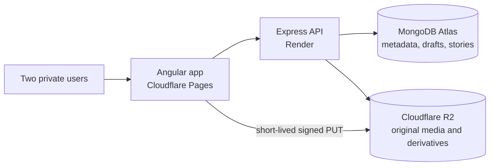
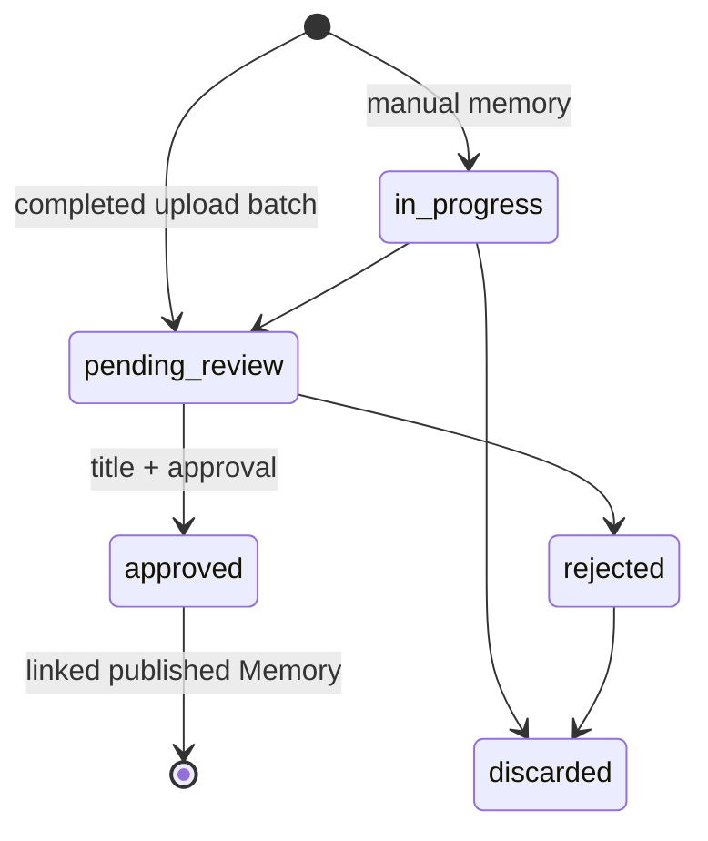
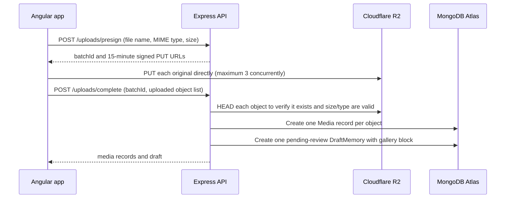

# Memories — Project Book

> A private digital home for a relationship: a place to return to the past,
> notice the present, and keep making room for the future.

**Document status:** living product and engineering record  
**Source of truth:** the project conversations, `chat.md`, and the implementation
currently in this repository.  
**Last consolidated:** 31 July 2026

---

## 1. What we are making

This is not meant to be a conventional photo-album website. It is a personal,
private relationship scrapbook for an anniversary: an experience that makes a
large collection of photos, videos, letters, voice notes, trips, and tiny
details feel reachable again in ordinary life.

The core problem is emotional as much as technical. Two people can have years
of media but almost never sit down to browse it. The app should make revisiting
those moments effortless, surprising, and warm: press a button, open a date,
follow a story, or receive a gentle reminder of a day that mattered.

The intended emotional arc is:

```text
remember the past  →  enjoy the present  →  look forward to the future
```

The relationship is the subject; the software is the quiet frame around it.
Every feature should earn its place by helping the couple remember, understand,
celebrate, or create a moment together.

## 2. Product principles

1. **Memories are stories, not albums.** A moment may contain a photograph,
   a sentence, a map pin, an audio note, a quote, a video, and a date. It must
   not be forced into a single caption-and-images shape.
2. **The site should feel alive, not archival.** Daily greetings, random
   memories, “on this day” resurfacing, changing quotes, and gentle movement
   turn stored media into an ongoing relationship space.
3. **Private, personal, and consentful by default.** These materials are
   intimate. The initial product is for two people, not a public social feed.
4. **Delight comes from intentional detail.** Envelope openings, paper-like
   letters, quiet animations, music only after an intentional click, and
   meaningful copy matter more than decorative complexity.
5. **Capture should be easy; curation should be satisfying.** A large existing
   collection must import safely, while final memories remain consciously
   shaped stories rather than accidental uploads.
6. **Build a small exceptional V1 before a large uneven product.** The chosen
   foundation supports many future experiences, but the first release should
   focus on the core emotional journey.

## 3. The desired experience

### 3.1 Home — “Welcome Home”

The entry point should feel immediate and personal rather than dashboard-like:

- a personal greeting (for example, “Hi Ani ❤️”);
- days together, perhaps with small human statistics such as cities visited;
- a “Ready for a memory?” invitation;
- a slow, curated backdrop of favourite photos;
- restrained soft motion and an optional song that stays muted until chosen;
- a rotating daily quote or small message.

The home page is not only navigation. It sets the emotional temperature before
the user chooses what to explore.

### 3.2 Random Memory Machine

This is intended to be one of the most repeatable experiences: a prominent
“Give me a memory” button that selects a memory and reveals its image(s), date,
place, story, tags, mood, and optionally weather or a map. It may be filtered
by a feeling or context rather than being completely random:

`Surprise me` · `Happy` · `Funny` · `Food` · `Travel` · `Emotional` · `Rain` ·
`Birthday` · `Festival`

The product value is the interruption of routine: a small, immediate route back
to a day that could otherwise stay buried in storage.

### 3.3 The relationship as a story

The timeline and cinematic “Story So Far” are the emotional centrepieces. They
should let someone move through first message, first date, first hug, first
trip, difficult moments, apologies, vacations, anniversaries, and the moments
that are important only to the two people involved. Selecting a milestone opens
its photos and narrative.

The long-form story page can progressively reveal photos, letters, maps,
changing music, and an upward day counter, ending with the idea: this is not an
ending; it is where the story happens to be today.

### 3.4 The future belongs in the product too

The scrapbook is not purely retrospective. Bucket-list items, future letters,
time capsules, date roulette, photo-recreation prompts, an adventure generator,
and anniversary countdowns make it a companion to the relationship’s next
chapters.

## 4. Experience catalogue

The following is the complete idea catalogue discussed so far. It is an idea
inventory, not a promise that every item ships in V1.

| Experience | Purpose / intended feeling | Stage |
| --- | --- | --- |
| Welcome Home | Greeting, day count, quote, photo atmosphere | V1 core |
| Random Memory Machine | A quick, meaningful surprise | V1 core |
| Timeline | Browse milestones and stories chronologically | V1 core |
| Photo gallery / photo galaxy | Explore images, filters, favourites; later make it spatial | V1 core then enhancement |
| Memory calendar / On This Day | Revisit previous years on the same date | V1 core |
| Letters and diary | Open envelope-like written memories | V1 core |
| Interactive map | Places, media, stories, restaurants, hotels and funny moments | V1 core |
| Bucket list and time capsule | Keep future dreams and sealed material | V1 core |
| Relationship Wrapped | A yearly reflection in the style of a recap | V1 core |
| Cinematic Story So Far | A carefully authored emotional journey | V1 core |
| Voice-note library | Hear voices, laughter and birthday wishes again | Later |
| Video vault | Organise trips, cooking, concerts and small clips | Later |
| Relationship statistics | Days, photos, trips, restaurants, movies and coffee dates | Later |
| Future letters / Open When | Locked, context-sensitive encouragement | Later |
| Spotify associations | Songs attached to moments and vice versa | Later |
| Mood explorer | Find by happy, calm, emotional, rainy, adventurous, lazy Sunday | Later |
| Conversation archive | Search meaningful old chat phrases | Later, privacy-sensitive |
| Guess the Memory / quiz | Playful recall together | Later |
| Secret messages | Hidden pages, phrases or Easter eggs | Later |
| Night sky | Recreate an important night’s sky through an astronomy data source | Later |
| Movie posters | Give trips and seasons a cinematic title card | Later |
| Digital scrapbook / polaroid wall | Tactile collage of tickets, receipts and photos | Later |
| Adventure generator / date roulette | Make a present-day plan together | Later |
| Memory wheel | Spin for a random photo, video, letter, audio, trip or date | Later |
| Year Wrapped | Favourite photo, city, trip, funny moment and milestone for each year | Later |
| Private guestbook | Chronological “thinking of you” notes | Later |
| Recipe book | Shared meals, ratings and funny failures | Later |
| Photo recreation challenge | Prompt to recreate an old photograph | Later |
| Mood check | Daily feeling log and an emotional timeline | Later, sensitive |
| AI story generator | Turn selected memories into a recap or movie-like narrative | Later, opt-in |
| Tiny Details wiki | Nicknames, preferences, inside jokes and important dates | Later |
| Constellation of Memories | Related moments rendered as connected stars | Later |
| Memory notifications | Gentle resurfacing without becoming intrusive | Later, opt-in |

## 5. First-release scope

The focused first version should make a complete loop rather than a collection
of isolated screens:

1. A beautiful home with a personal greeting and relationship statistics.
2. An upload flow that can ingest a substantial existing collection safely.
3. A draft inbox where uploaded items become deliberate stories.
4. A block-based memory editor for text, photos, galleries, video, maps,
   quotes, headings, and dividers.
5. Published memories shown through a timeline, gallery, memory detail page,
   random-memory experience, and “on this day” view.
6. Letters/diary, map, bucket list/future capsule, a yearly recap, and the
   cinematic story page as the high-value authored experiences.

The current implementation has completed the backend half of the import,
draft, and lifecycle foundation. The Angular upload, inbox, editor, and
viewing experiences are the next product work.

## 6. Technology and deployment architecture

| Concern | Decision | Why |
| --- | --- | --- |
| Frontend | Angular 22, TypeScript, Angular Router, Tailwind/Angular Material available | Strong structured application foundation for an editor and multiple views |
| API | Express 5 with TypeScript | Small, clear REST API for a personal V1 |
| Database | MongoDB Atlas with Mongoose | Flexible document model for varied story blocks and metadata |
| Original media | Cloudflare R2 (S3-compatible) | Object storage suitable for a growing photo/video library |
| Frontend hosting | Cloudflare Pages | Static Angular hosting with SPA redirect support |
| API hosting | Render | Hosts Express and coordinates data without serving bulk media bytes |
| Shared contracts | `shared/contracts/memory.ts` | Keeps the frontend/API shape aligned without coupling Angular to Mongoose |



The direct browser-to-R2 line is deliberate: it prevents the Render service
from becoming a costly and fragile relay for a large media import.

## 7. Why the project is memory-first

The central domain object is a **Memory**, not an album, trip, photo, or page.
Each surface—timeline, gallery, random machine, map, calendar, search, and
annual recap—is a different way to discover the same underlying material.

That avoids data silos. A rainy Goa photo can belong to a trip, appear on the
map, be tagged `rain`, surface on its anniversary, be part of a gallery block,
and be selected by the Random Memory Machine without being copied into five
separate systems.

### 7.1 Core entities

| Entity | Responsibility | Important fields |
| --- | --- | --- |
| `Media` | One independently stored image, video, or audio asset | R2 key(s), type, metadata, date taken, location, hash, processing state |
| `Memory` | A published relationship story | title, ordered blocks, cover media, date, location, tags, moods, favourite, publication time |
| `DraftMemory` | An unfinished manual story or a proposed story created from an upload | source, status, candidate media, editable blocks, optional AI suggestion, final memory reference |
| `Tag` | Reusable categorisation | normalised name and slug; supports filtering and discovery |
| `MemoryBlock` | One ordered moment inside a story | type, position, caption, polymorphic content, optional metadata |

### 7.2 Blocks

Supported block types are `text`, `heading`, `image`, `gallery`, `video`,
`map`, `quote`, and `divider`. The `content` field is deliberately polymorphic:
examples include `{ text }`, `{ mediaId }`, `{ mediaIds }`, or `{ latitude,
longitude, placeName }`. This enables a rich story editor now and leaves room
for voice notes, weather, song links, or other story moments later without a
database migration.

### 7.3 Draft lifecycle



`DraftMemory` exists for two equally valid situations: a person begins a story
and has not finished it, or a batch of newly uploaded media needs curation.
Approval turns the draft into a `Memory` in an Atlas transaction and preserves
the draft’s link to the resolved memory.

## 8. Media architecture and large-library import

The project is expected to handle a sizeable existing library (the discussion
specifically raised an approximately 35 GB collection). This has direct design
consequences: importing must not run all file bytes through Render.

### 8.1 Chosen upload flow



Files never pass through the Render process. Express supplies short-lived,
single-object permissions and retains the authority to validate completion and
write database records; R2 secret credentials are never sent to the browser.

### 8.2 Limits and operational stance

Current V1 limits are intentionally conservative:

- maximum 20 files per batch and 500 MB total per batch;
- images up to 25 MB each;
- videos up to 500 MB each;
- audio up to 100 MB each;
- no more than three concurrent browser uploads;
- signed upload URLs expire after 15 minutes.

This is safer for a library import than relaying every file through a Render
free service, whose memory and traffic constraints make it a poor bulk-media
pipe. R2 remains the object store; extremely large objects can be handled with
multipart upload in a later iteration if needed.

### 8.3 Media processing

`Media` has `pending`, `processing`, `ready`, and `failed` processing states,
plus original, preview, and thumbnail R2 keys. The current direct upload flow
stores the original and creates a `pending` media record. Thumbnail/preview
generation is planned next—first for images, with a placeholder approach for
video—rather than pretending it already exists.

### 8.4 Storage design

MongoDB stores R2 **object keys**, not public URLs. A future CDN, custom media
domain, or access-policy change can therefore happen without migrating every
record. For private media, `GET /api/uploads/media/:id/read-url` creates a
temporary signed read URL. A custom media domain can replace this later without
changing the domain models.

## 9. API currently implemented

All routes start with `/api`. There is no user authentication in the private
two-person V1. That is a conscious temporary constraint: the API must not be
made publicly reachable without introducing authentication and authorisation.

| Area | Endpoint | Behaviour |
| --- | --- | --- |
| Health | `GET /health` | Returns service status and timestamp |
| Upload | `POST /uploads/presign` | Validates selected files; returns `batchId` and signed R2 PUT URLs |
| Upload | `POST /uploads/complete` | Verifies R2 objects, creates `Media`, creates a gallery-based `DraftMemory` |
| Media read | `GET /uploads/media/:id/read-url` | Returns temporary private read URL |
| Media | `GET /media`, `DELETE /media/:id` | List latest media; safely delete an unreferenced asset and R2 derivatives |
| Drafts | `GET, POST /drafts` | List or start a draft |
| Draft | `GET, PATCH, DELETE /drafts/:id` | View, curate, or delete one draft |
| Approval | `POST /drafts/:id/approve` | Atomically create a published memory and link the draft |
| Memories | `GET, POST /memories` | List or create memories |
| Memory | `GET, PATCH, DELETE /memories/:id` | View, edit, or delete one published story |

Approval requires a title and returns `422` if no title has been supplied. A
second approval attempt returns `409 Conflict`. Memory, draft, and media IDs
are validated; unexpected errors are not exposed as internal implementation
details to API callers.

## 10. Deletion and data-safety rules

These rules are important because media can be reused by more than one story.

| Action | Result |
| --- | --- |
| Delete a draft | Deletes only the draft document; it never deletes the media automatically |
| Delete a memory | Deletes only the memory document; it never deletes the media automatically |
| Delete a media item that is still referenced | Refused with `409 Conflict` until it is removed from every draft and memory |
| Delete unreferenced media | Deletes original, preview and thumbnail objects from R2, then the MongoDB media record |

This prevents a destructive cascade where removing one story silently erases a
photo still used somewhere else. UI confirmation and an eventual recoverable
trash/archive layer are sensible follow-on enhancements.

## 11. Frontend architecture and current state

The Angular application already has routes for:

- `/` — home;
- `/gallery` — gallery;
- `/timeline` — timeline;
- `/memory/:id` — memory detail.

They are currently scaffold components, not connected user experiences. The
local development server uses an `/api` proxy to the Express API. Cloudflare
Pages has an SPA redirect rule so direct route visits do not 404 in production.

The next frontend slices are, in order:

1. **Upload:** drag/drop and picker, request presigned URLs, upload with
   progress/retry, complete the batch, then link to its draft.
2. **Draft Inbox:** cards with secure preview URLs and draft status.
3. **Draft editor:** title, date, place, moods, tags, cover selection,
   candidate-media curation, and block ordering/editing.
4. **Publish:** clear approval action and friendly success state.
5. **Viewing:** memory-detail page, timeline, gallery/search and a thoughtful
   home surface.

The visual direction should be intimate rather than enterprise: warm spacing,
legible editorial type, deliberate motion, accessible contrast, keyboard
navigation, and a clear reduced-motion preference. Animation should reveal or
support a story; it should not make a private memory hard to read.

## 12. Security, privacy, and operational requirements

- Keep Atlas, R2 and JWT/environment secrets in the backend environment only;
  never commit `.env` values or put R2 credentials in Angular.
- Apply the existing Helmet and explicit CORS configuration. `CORS_ORIGINS`
  must include `http://localhost:4200` in development and the actual
  Cloudflare Pages domain in production.
- Direct browser uploads require an R2 bucket CORS rule. The current token can
  read/write objects but was unable to alter bucket CORS; it needs temporary
  bucket-configuration/R2 Admin write access to run `npm run configure:r2-cors`.
  Restore the lower-privilege object token afterwards if preferred.
- Treat upload metadata, location, conversations, and AI-generated summaries
  as sensitive. Provide clear controls before introducing shared links,
  notifications, AI processing, or chat import.
- Back up the Atlas database and maintain an export strategy for R2 object
  keys/metadata before the library grows irreplaceable.
- Add authentication, authorisation, rate limits, audit trails, and stronger
  ownership checks before any public deployment or expansion beyond the two
  intended users.

## 13. Decisions and rationale

| ID | Decision | Rationale |
| --- | --- | --- |
| ADR-001 | Use a memory-first domain model | Every experience can query the same stories rather than duplicate media into feature silos |
| ADR-002 | Model story content as ordered blocks | A fixed caption-plus-photos record cannot express a real relationship story |
| ADR-003 | Keep `Media` independent from `Memory` | One asset can be reused, processed, inspected and safely deleted on its own lifecycle |
| ADR-004 | Use `DraftMemory` | Uploading is not publishing; both manual unfinished work and automatic batch suggestions need review |
| ADR-005 | Store R2 keys, not URLs | Storage/CDN/access changes do not require a database migration |
| ADR-006 | Use browser-to-R2 signed uploads | A large import should not double-transfer bytes through Render |
| ADR-007 | Preserve media on draft/memory deletion | Prevent loss of assets that may be used in another story |
| ADR-008 | Make approval transactional | A published memory and its draft link must either both succeed or both fail |
| ADR-009 | Delay AI and complex discovery experiences | They should enrich carefully curated human memories, not determine the V1 shape |
| ADR-010 | Start private and add auth before broader access | Intimate relationship material deserves stronger protection than a prototype provides |

## 14. Verification completed

The following has already been verified during the project work:

- backend TypeScript compilation;
- frontend production build after correcting the Angular route export;
- Mongoose model validation smoke test;
- real MongoDB Atlas connection after switching to the standard connection
  string when SRV DNS resolution was unavailable in the workspace;
- real R2 object write and cleanup permission;
- end-to-end presign → direct upload → completion → draft creation → draft
  deletion → safe media deletion using temporary test data that was cleaned up.

R2 bucket CORS configuration is the remaining prerequisite before the browser
can perform direct uploads against the deployed/local Angular origin.

## 15. Roadmap

### Now — finish the first vertical slice

1. Apply R2 CORS configuration with suitable temporary permission.
2. Build the Angular upload screen and progress/error states.
3. Build Draft Inbox and Draft Editor.
4. Add image preview/thumbnail processing.
5. Publish drafts into memories from the UI.

### Next — make the archive enjoyable

1. Implement memory detail, gallery filters/search and timeline.
2. Build the home experience and Random Memory Machine.
3. Add date-based “On This Day,” map, letters/diary and favourites.
4. Create the cinematic Story So Far page and a first annual Wrapped view.

### Later — enrich with care

1. Bucket list, future letters/time capsules, guestbook and date roulette.
2. Audio/video experiences, richer media processing, EXIF extraction and
   duplicate detection.
3. Search across stories, tags, dates, places and selected media metadata.
4. Opt-in AI suggestions: title, summary, mood and narrative recap, always
   editable and never a replacement for the couple’s own voice.
5. Authentication and hardened privacy controls before adding sharing,
   notifications or multi-user expansion.

## 16. Open questions to decide deliberately

- What is the exact anniversary date, day-one date, and the personal language
  used in greetings and copy?
- Which media is safe to include, and does either person need an approval or
  hide mechanism for a memory?
- What level of authentication is required before the first deployment, even
  if only two people use it?
- Is the home page primarily for one recipient as an anniversary gift, or a
  jointly maintained space from day one?
- Which visual references (paper, polaroid, night sky, editorial journal,
  playful scrapbook) best match the relationship rather than generic romance?
- Which experiences should be intentionally excluded from V1 to protect time
  for the core story, import, and curation experience?

## 17. Current project level

The project is beyond a blank scaffold: the database domain, deployment
boundaries, direct-upload lifecycle, CRUD endpoints, safe deletion rules, and
shared contracts are in place and tested. It is not yet a usable anniversary
site because the interface and curation/viewing experiences have not been
connected to those capabilities.

```text
Product vision and feature inventory       complete
Memory-first domain design                 complete
Atlas and R2 infrastructure                connected and verified
Express API and lifecycle endpoints         implemented and smoke-tested
R2 browser CORS                             pending permission/configuration
Angular upload and draft inbox              not implemented
Memory editor                               not implemented
Home, gallery, timeline, detail experiences scaffolded, not connected
Authentication / production hardening       intentionally deferred
```

The most valuable next step is not another feature idea. It is completing the
upload → draft → curated story → published memory loop, then showing that
memory beautifully. Once that loop feels right, the rest of the experience
catalogue has a durable and emotionally coherent foundation.

---

## Appendix: repository landmarks

- `memories-backend/src/modules/media/` — media model and safe deletion API.
- `memories-backend/src/modules/memory/` — memory, draft and block models plus
  lifecycle APIs.
- `memories-backend/src/modules/upload/` — signed direct upload and completion
  logic.
- `memories-backend/API.md` — concrete request/response upload reference.
- `shared/contracts/memory.ts` — framework-neutral editor/API contracts.
- `memories-frontend/src/app/` — Angular app routes and presentational
  component scaffolds.
- `chat.md` — earlier implementation conversation and verification trail.
